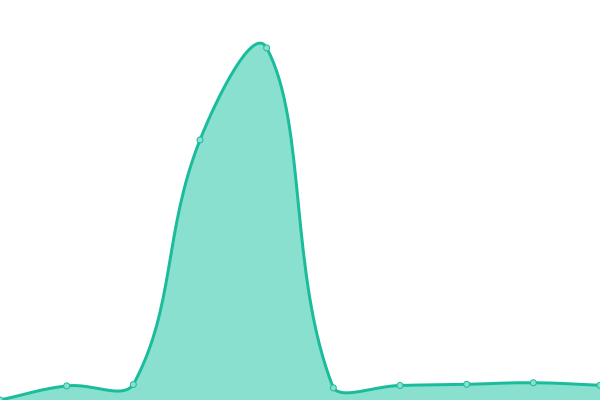

# [📈 Live Status](https://status.wetrackit.com.au): <!--live status--> **🟧 Partial outage**

This repository contains the open-source uptime monitor and status page for [WeTrackIT-NT](https://status.wetrackit.com.au), powered by [Upptime](https://github.com/upptime/upptime).

With [Upptime](https://upptime.js.org), you can get your own unlimited and free uptime monitor and status page, powered entirely by a GitHub repository. We use [Issues](https://github.com/WeTrackIT-NT/status/issues) as incident reports, [Actions](https://github.com/WeTrackIT-NT/status/actions) as uptime monitors, and [Pages](https://status.wetrackit.com.au) for the status page.

<!--start: status pages-->
<!-- This summary is generated by Upptime (https://github.com/upptime/upptime) -->
<!-- Do not edit this manually, your changes will be overwritten -->
<!-- prettier-ignore -->
| URL | Status | History | Response Time | Uptime |
| --- | ------ | ------- | ------------- | ------ |
|  [Website](https://www.wetrackit.com.au) | 🟩 Up | [website.yml](https://github.com/WeTrackIT-NT/status/commits/HEAD/history/website.yml) | 

 8106ms
     
 | 

<a href="https://status.wetrackit.com.au/history/website">100.00%</a>
    

|  [Tracking Dashboard](https://app.wetrackit.com.au) | 🟩 Up | [tracking-dashboard.yml](https://github.com/WeTrackIT-NT/status/commits/HEAD/history/tracking-dashboard.yml) | 

 1138ms
     
 | 

<a href="https://status.wetrackit.com.au/history/tracking-dashboard">100.00%</a>
    

|  Devices - Teltonika Support | 🟩 Up | [devices-teltonika-support.yml](https://github.com/WeTrackIT-NT/status/commits/HEAD/history/devices-teltonika-support.yml) | 

 213ms
     
 | 

<a href="https://status.wetrackit.com.au/history/devices-teltonika-support">100.00%</a>
    

|  Devices - TopFlyTech Support | 🟩 Up | [devices-top-fly-tech-support.yml](https://github.com/WeTrackIT-NT/status/commits/HEAD/history/devices-top-fly-tech-support.yml) | 

 210ms
     
 | 

<a href="https://status.wetrackit.com.au/history/devices-top-fly-tech-support">100.00%</a>
    

|  [LEGACY Tracking Dashboard](https://dashboard.wetrackit.com.au) | 🟥 Down | [legacy-tracking-dashboard.yml](https://github.com/WeTrackIT-NT/status/commits/HEAD/history/legacy-tracking-dashboard.yml) | 

 0ms
     
 | 

<a href="https://status.wetrackit.com.au/history/legacy-tracking-dashboard">0.00%</a>
    

<!--end: status pages-->

[**Visit our status website →**](https://status.wetrackit.com.au)

## 📄 License

- Powered by: [Upptime](https://github.com/upptime/upptime)
- Code: [MIT](./LICENSE) © [Anand Chowdhary](https://anandchowdhary.com), supported by [Pabio](https://pabio.com)
- Data in the `./history` directory: [Open Database License](https://opendatacommons.org/licenses/odbl/1-0/)
